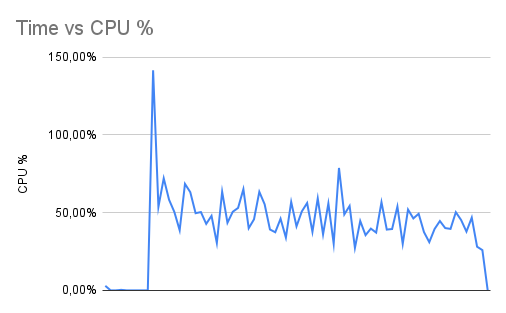
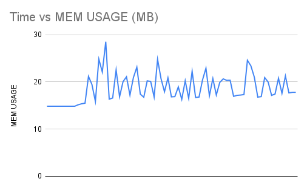

## Build

```sh
podman build -t safefleet.net/ffmpeg:6.1.1 -f vendors/ffmpeg/Dockerfile
podman build -t safefleet.net/video-buff:1.0.0 -f deployments/Dockerfile .
```

debian:bullseye-slim = 84.04 MB (base)
ffmpeg:6.1.1 = 89.73 MB (final)
app relative size = 5.69 MB

node:20.10.0-buster-slim = 201.09 MB (base)
video-buff:1.0.0 = 237.08 MB (final)
app relative size = 35.99 MB

## Performance

Processor: 11th Gen Intel(R) Core(TM) i3-1115G4 @ 3.00GHz 2.90 GHz (2 cores)
RAM: 8,00 GB (7,65 GB utilizable)
OS: Windows 11 22H2

```sh
podman stats --format "table {{.Name}},{{.CPUPerc}},{{.MemUsage}}" video-buff-test >> "video-buff-stats.csv"
```

[report](./test/performance/performance-report.html)

Footprint: 18.6 MB - 46.52 %



